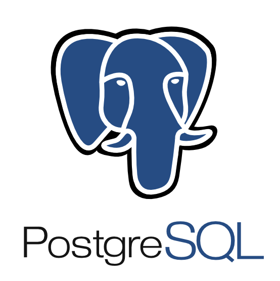

## Всем привет! 👋

#### Меня зовут Владимир, я QA Engineer

- 🔥 4+ лет в тестировании
- 🐍 Пишу автотесты на Python
- ⚙️ Развиваюсь в автоматизации
- 📑 Опыт и навыки в **[резюме](https://career.habr.com/vladimir_084)**
- 📞 Мои контакты:
  - 
  - 
  <!-- Документация по виджету контактов ↑↑: https://shields.io/badges --> 

## Тестирование API и интеграций

  &nbsp
  &nbsp
  &nbsp
  &nbsp
  &nbsp
  &nbsp
  &nbsp

## Тестирование API и интеграций / skillicons

  &nbsp
  &nbsp
  &nbsp
  &nbsp

## Тестирование API и интеграций / profile-technology-icons

  &nbsp
  &nbsp

### Python QA Auto

#### Мой стек:
| Python                                                | PyCharm                                               | Git                                               | Pytest                                               | Requests                                               | Selenium                                               | Allure Report                                                                        | Docker                                               | Gitlab CI                                             | PostgreSQL                                            |
|-------------------------------------------------------|-------------------------------------------------------|---------------------------------------------------|------------------------------------------------------|--------------------------------------------------------|--------------------------------------------------------|--------------------------------------------------------------------------------------|------------------------------------------------------|-------------------------------------------------------|-------------------------------------------------------|
|   |  |  |  |  |  | 

 |  |   |  |

#### Мои проекты:
| API My Shows Rating                                                          | API Битва покемонов                                                                    | UI Битва покемонов                                                                     |
|------------------------------------------------------------------------------|----------------------------------------------------------------------------------------|----------------------------------------------------------------------------------------|
| [my-shows-api-tests](https://github.com/VladimirTitov-QA/my_shows_api_tests) | [pokemonbattle-api-tests](https://github.com/VladimirTitov-QA/pokemonbattle_api_tests) | [pokemonbattle-e2e-tests](https://github.com/VladimirTitov-QA/pokemonbattle_e2e_tests) |
| Pytest, Requests, Docker                                                     | Pytest, Requests, Gitlab CI                                                            | Selenium, Gitlab CI                                                                    |

### 📚 Обучение

  

  
  

### 📊 Статистика
<!-- Виджет: график активности -->

<!-- Выбор темы ↑↑: https://github.com/Ashutosh00710/github-readme-activity-graph/blob/main/THEMES.md -->

<!-- Виджет: общая статистика -->

<!-- Виджет: языки программирования -->

<!-- Выбор темы ↑↑: https://github.com/anuraghazra/github-readme-stats/blob/master/themes/README.md -->
<!-- Настройка отображения ↑↑: https://github.com/anuraghazra/github-readme-stats/ -->

**В этом файле используется верстка [Markdown](https://www.markdownguide.org/basic-syntax/)**

<!--
**VladimirTitov-QA/VladimirTitov-QA** is a ✨ _special_ ✨ repository because its `README.md` (this file) appears on your GitHub profile.

Here are some ideas to get you started:

- 🔭 I’m currently working on ...
- 🌱 I’m currently learning ...
- 👯 I’m looking to collaborate on ...
- 🤔 I’m looking for help with ...
- 💬 Ask me about ...
- 📫 How to reach me: ...
- 😄 Pronouns: ...
- ⚡ Fun fact: ...
-->
